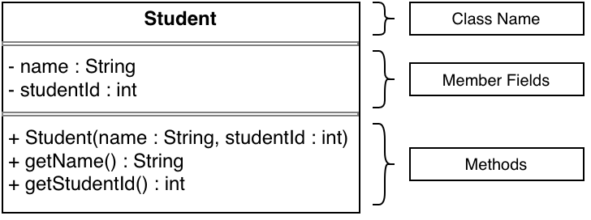

# Reading a UML

## Class, Fields, Methods

  

A UML begins with the name of the class. Under that begins the member fields. Under the member fields begins the methods.

The type of parameters, member fields, and method return types are always in the form a colon (:) followed by the type. 

## Visibility
Visibility modifiers are denoted by a symbol before the member field or method.
* `+` : `public`
* `-` : `private`

## Static Members
Static members are denoted by an underline. Below, `totalStudents` and `getTotalStudents` are static.

  

