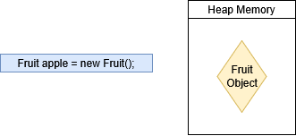
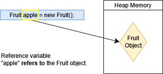

# Reference Variables
A **reference variable** is a variable that stores the memory address of an object rather than storing the data value itself.

When we create an object, space is reserved in the **heap memory** for it.



 To access that specific piece in the heap memory, we use a reference variable to "refer" to it.


## Assignments
Using variables in assignments creates a **copy of the reference**.

Assume we have a class `Animal`.

```java
Animal animalA = new Animal("Rocky");
Animal animalB = animalA;
```

`animalB` is assigned the value of `animalA`. `animalA` points to an object on the heap. Thus, `animalB` points to that same object.